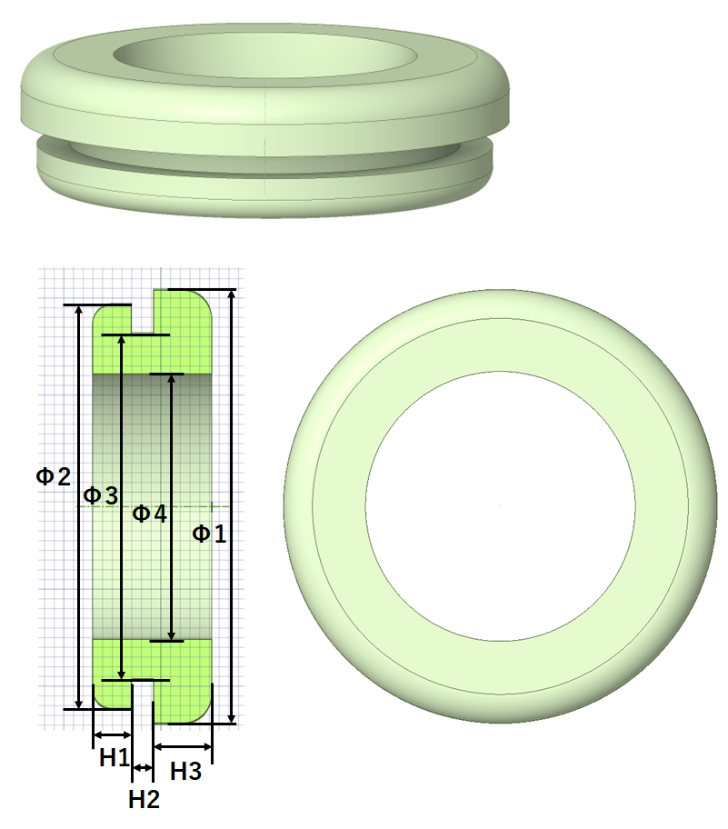
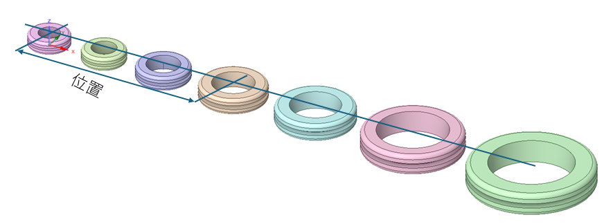

# 両端フランジつき円筒（グロメット）の自動作図

## 作図パラメータ

パラメータはCSVで指定する。

+ 型番:　部品の型番、出力するソリッド名
+ H1: 下側厚み
+ H2: 筒高さ
+ H3: 上側厚み
+ P1: 上側直径
+ P2: 下側直径
+ P3: 筒外形
+ P4 筒内径
+ オフセット位置

例：
| 型番   | 下側厚み(H1) | 筒の高さ(H2) | 上側厚み(H3) | 上側直径(P1) | 下側直径(P2) | 筒外形(P3) | 筒内径(P4) | 位置 |
|--------|------------|------------|------------|------------|------------|------------|------------|----|
| SG-9A  | 2          | 2.3        | 3.5        | 16         | 13         | 9          | 4.5        | 0  |
| SG-12A | 1.5        | 1.6        | 2.5        | 19         | 16         | 12         | 7          | 28 |
| SG-14A | 2          | 2.3        | 3          | 21         | 18         | 14         | 9          | 58 |
| SG-16A | 2          | 1.6        | 3.5        | 23         | 20         | 16         | 11         | 90 |

生成結果
https://www.cad-data.com/cad/Soil_y_1.html